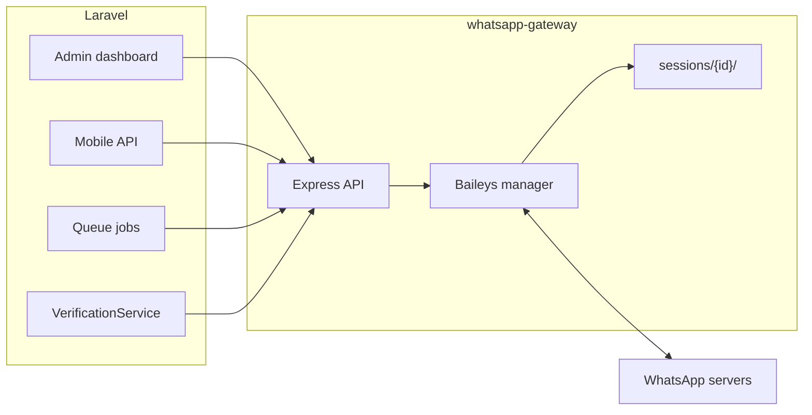

# WhatsApp Gateway — Full Technical Report

> **Purpose:** Reference document for developers and ops. Covers architecture, admin dashboard behavior, OTP/system session disconnect causes, and step-by-step troubleshooting.
>
> **Last updated:** 2026-06-23  
> **Related docs:** `whatsapp_workflow.md`, `whatsapp-gateway/docs/API.md`, `whatsapp-gateway/README.md`

---

## Table of contents

1. [System overview](#1-system-overview)
2. [Architecture](#2-architecture)
3. [Session types](#3-session-types)
4. [Gateway HTTP API](#4-gateway-http-api)
5. [Connection lifecycle](#5-connection-lifecycle)
6. [Admin dashboard — WhatsApp (OTP)](#6-admin-dashboard--whatsapp-otp)
7. [Admin dashboard — Linked clients](#7-admin-dashboard--linked-clients)
8. [Mobile app WhatsApp flow](#8-mobile-app-whatsapp-flow)
9. [OTP send path](#9-otp-send-path)
10. [Why the system OTP disconnects after a short time](#10-why-the-system-otp-disconnects-after-a-short-time)
11. [Disconnect causes (complete list)](#11-disconnect-causes-complete-list)
12. [Status fields reference](#12-status-fields-reference)
13. [Environment variables](#13-environment-variables)
14. [Session storage on disk](#14-session-storage-on-disk)
15. [Developer troubleshooting steps](#15-developer-troubleshooting-steps)
16. [Operational runbook](#16-operational-runbook)
17. [Known issues and design notes](#17-known-issues-and-design-notes)

---

## 1. System overview

Qeran uses a **two-layer WhatsApp integration**:

| Layer | Technology | Location |
|-------|------------|----------|
| **Gateway** | Node.js + Express + `@whiskeysockets/baileys` | `whatsapp-gateway/` |
| **App** | Laravel (admin UI, mobile API, jobs) | `app/Services/External/BaileysGateway.php`, etc. |

Laravel never talks to WhatsApp directly. It calls the gateway over HTTP with `Authorization: Bearer {BAILEYS_GATEWAY_SECRET}`.



---

## 2. Architecture

### 2.1 Gateway entry point

| File | Role |
|------|------|
| `whatsapp-gateway/src/index.ts` | Express app, routes, auth middleware, startup |
| `whatsapp-gateway/src/baileys/manager.ts` | Session lifecycle, Baileys sockets, reconnect, watchdog |
| `whatsapp-gateway/src/baileys/send.ts` | Outbound message sending |
| `whatsapp-gateway/src/baileys/events.ts` | Inbound message handling |
| `whatsapp-gateway/src/baileys/receipts.ts` | Delivery/read webhooks to Laravel |
| `whatsapp-gateway/ecosystem.config.cjs` | PM2 process config |

**Startup sequence** (`index.ts` lines 608–614):

1. Listen on `HOST:PORT` (default `127.0.0.1:3000`)
2. `restorePersistedSessions()` — re-open sockets for registered sessions on disk
3. `startConnectedSessionWatchdog()` — periodic probe every 45s (configurable)

### 2.2 Laravel integration layer

| File | Role |
|------|------|
| `app/Services/External/BaileysGateway.php` | HTTP client to gateway |
| `app/Services/External/BaileysWhatsApp.php` | Send wrapper (`sent`, `id`, `error`) |
| `app/Services/WhatsApp/WhatsAppSystemSessionService.php` | System session DB sync, admin lock, auto-reconnect |
| `app/Services/WhatsApp/UserWhatsAppSessionService.php` | Client session admin disconnect |
| `app/Models/WhatsappSession.php` | DB model |
| `app/Http/Controllers/Admin/WhatsAppSystemController.php` | OTP admin dashboard |
| `app/Http/Controllers/Admin/WhatsAppClientsController.php` | Linked clients dashboard |
| `app/Http/Controllers/Api/V1/WhatsApp/WhatsAppConnectController.php` | Mobile connect/status/disconnect |

### 2.3 Database

**Table:** `whatsapp_sessions`

| Column | Meaning |
|--------|---------|
| `session_id` | `system` or `user_{id}` (unique) |
| `user_id` | `null` for system; FK for clients |
| `status` | `connected`, `disconnected`, `reconnecting`, `pending_qr`, `pending_pairing`, `starting` |
| `phone` | Linked WhatsApp number |
| `connected_at` | When session became live |
| `disconnected_at` | When session dropped or was disconnected |
| `last_seen_at` | Last gateway sync |

---

## 3. Session types

| Session ID | Phone | Link method | Used for |
|------------|-------|-------------|----------|
| `system` | Qeran business number | **QR only** (admin) | OTP, contact-us, admin replies |
| `user_{id}` | Client's WhatsApp | **Pairing code** (mobile app) | Bulk invitation sends from client number |

> **Important:** The `system` session **must never use pairing code**. The gateway explicitly blocks and wipes pairing creds on the system session (`manager.ts` lines 735–746, 1301–1305, 1375–1395).

---

## 4. Gateway HTTP API

**Base URL:** `BAILEYS_GATEWAY_URL` (public) or `BAILEYS_GATEWAY_INTERNAL_URL` (server-side, preferred)

**Auth:** `Authorization: Bearer {BAILEYS_GATEWAY_SECRET}` on all routes except `GET /health`

| Method | Path | Purpose |
|--------|------|---------|
| `GET` | `/health` | Liveness, version, feature flags |
| `GET` | `/health/receipt-probe` | Test receipt webhook to Laravel |
| `GET` | `/sessions/:id/qr/page` | Browser QR setup page (token in query) |
| `POST` | `/sessions` | Start session (QR or pairing) |
| `GET` | `/sessions/:id/status` | Session status (`?quick=1` for fast poll) |
| `GET` | `/sessions/:id/qr` | QR string + base64 PNG (`?waitMs=`) |
| `GET` | `/sessions/:id/pairing-code` | Pairing code for mobile |
| `POST` | `/sessions/:id/finalize` | Complete pairing after code accepted |
| `POST` | `/send` | Send text message |
| `DELETE` | `/sessions/:id` | Logout + wipe session files |

Full contract: `whatsapp-gateway/docs/API.md`

---

## 5. Connection lifecycle

### 5.1 System session (QR — admin OTP)

```
Admin opens /admin/whatsapp-system
  → Click "Generate QR"
  → POST /admin/whatsapp-system/prepare
       clearAdminDisconnect()
       if registered on disk but socket down → POST gateway /sessions (reconnect)
       else → POST gateway /sessions (fresh QR)
  → GET /admin/whatsapp-system/qr?waitMs=3000..20000 (poll up to 30 attempts)
  → Admin scans QR on business phone
  → GET /admin/whatsapp-system/status (poll every 3s)
       maybeReconnect() if creds exist but socket down
       syncFromGateway() → whatsapp_sessions row
  → status = connected, socketAlive = true
```

### 5.2 Client session (pairing code — mobile)

```
App POST /api/v1/whatsapp/connect { phone }
  → deleteSession() (wipe old creds)
  → gateway POST /sessions { sessionId: user_{id}, phone, linkMethod: pairing }
  → Response: pairing_code (XXXX-XXXX)
  → User enters code in WhatsApp → Linked devices → Link with phone number
  → App polls GET /api/v1/whatsapp/status
  → gateway finalize + reconnect until registered + connected
```

### 5.3 Gateway internal states

| Status | Meaning |
|--------|---------|
| `starting` | Socket being created |
| `pending_qr` | QR issued, waiting for scan |
| `pending_pairing` | Pairing code issued or code accepted, waiting for "Link device" |
| `connected` | WebSocket open, registered |
| `reconnecting` | Creds on disk, socket down, recovery in progress |
| `disconnected` | No live connection |

### 5.4 Reconnect mechanisms

| Mechanism | Interval | File |
|-----------|----------|------|
| **Watchdog** | 45s (default) | `manager.ts` → `runConnectedSessionWatchdog()` |
| **Status poll reconnect** | On each `GET /status?quick=1` | `index.ts` lines 320–331 |
| **Laravel maybeReconnect** | Throttled 8s | `WhatsAppSystemSessionService::maybeReconnect()` |
| **Backoff schedule** | 30s → 2m → 10m | `RECONNECT_BACKOFF_MS` env |
| **Pairing keepalive** | 15s | Keeps socket alive during pairing code entry |

### 5.5 What "live connected" means

A session is truly connected only when **all three** are true:

```
status === 'connected'
AND socketAlive === true   (Baileys WebSocket open)
AND registeredOnDisk === true   (creds.json has registered: true)
```

Function: `isLinkedOnWhatsApp()` in `manager.ts` line 70–76.

---

## 6. Admin dashboard — WhatsApp (OTP)

**URL:** `/admin/whatsapp-system`  
**Route name:** `admin.whatsapp-system.index`  
**Menu:** Settings → WhatsApp (OTP) / ربط واتساب (OTP)

### 6.1 Page layout

| Section | Content |
|---------|---------|
| **Title** | WhatsApp system / OTP linking |
| **Config warning** | Shown if `BAILEYS_GATEWAY_URL` or `BAILEYS_GATEWAY_SECRET` missing |
| **Session ID** | Always `system` (or `BAILEYS_SYSTEM_SESSION`) |
| **Gateway URL** | Internal URL if set, else public URL |
| **Status box** | Live connection badge, phone, QR, uptime meta |
| **Actions** | Generate QR, Disconnect |
| **Instructions** | 3-step scan guide |
| **Troubleshooting** | 4 bullet hints for QR issues |

### 6.2 Status box fields (AJAX-updated every 3s)

| UI element | Source | Badge color |
|------------|--------|-------------|
| Connection status | `data.status` | green=connected, yellow=pending_qr, red=gateway error, gray=disconnected/starting |
| Linked phone | `data.phone` | Shown when connected |
| QR image | `data.qrImage` from `/qr` endpoint | Shown when pending_qr |
| Uptime | `session_meta.uptime_seconds` | Formatted as Xh Ym or Xm Ys |
| Last session duration | `session_meta.last_session_seconds` | Previous connect→disconnect span |
| Admin lock warning | `session_meta.admin_disconnect_locked` | Yellow text — manual disconnect active |
| Auto-reconnect hint | Shown when not admin-locked | Gray helper text |

### 6.3 Buttons and actions

| Button | HTTP | What it does |
|--------|------|--------------|
| **Generate QR** | `POST /admin/whatsapp-system/prepare` then `GET /admin/whatsapp-system/qr?waitMs=` | Clears admin disconnect lock; starts or reconnects gateway session; polls for QR image (up to 30 attempts) |
| **Disconnect** | `POST /admin/whatsapp-system/disconnect` | Sets 30-day cache lock; `DELETE /sessions/system` on gateway; marks DB disconnected |

### 6.4 Backend routes (not all visible in UI)

| Route | Method | Purpose |
|-------|--------|---------|
| `admin.whatsapp-system.status` | GET | JSON status for polling |
| `admin.whatsapp-system.prepare` | POST | Start/reconnect session before QR |
| `admin.whatsapp-system.qr` | GET | Fetch QR image |
| `admin.whatsapp-system.refresh-qr` | POST | Redirect with `wa_auto_generate` flash (not linked in UI) |
| `admin.whatsapp-system.disconnect` | POST | Full disconnect |

### 6.5 Status endpoint logic (`WhatsAppSystemController@status`)

1. If gateway not configured → 503
2. If `adminRequestedDisconnect()` → force `disconnected`, skip gateway, set `admin_disconnect: true`
3. Else `BaileysGateway::getStatus(sessionId, quick=true)`
4. `maybeReconnect()` if registered but socket down (unless admin locked)
5. `syncFromGateway()` → update `whatsapp_sessions`
6. Return JSON with `data` + `session_meta`

### 6.6 JavaScript polling behavior

- Status poll: every **3 seconds**
- QR generation: up to **30 attempts**, waitMs 3s first then 20s
- Stops QR refresh when connected
- Continues status poll after connect (to refresh uptime)

---

## 7. Admin dashboard — Linked clients

**URL:** `/admin/whatsapp-clients`  
**Route name:** `admin.whatsapp-clients.index`  
**Menu:** Settings → Linked WhatsApp clients

### 7.1 Filters (tabs)

| Filter | Query | Shows |
|--------|-------|-------|
| All | `?filter=all` | All `user_*` sessions |
| Connected | `?filter=connected` | DB status = connected |
| Disconnected | `?filter=disconnected` | Everything else |

Paginated: 20 per page. Excludes `system` session.

### 7.2 Table columns

| Column | Source | Notes |
|--------|--------|-------|
| **Client** | `user.name`, `user.email`, `user_id` | |
| **WhatsApp number** | Session/user phone, formatted | |
| **Session ID** | e.g. `user_42` | |
| **App status** | DB `whatsapp_sessions.status` | Badge: success=connected, warning=pending_*, secondary=disconnected |
| **Gateway status** | Live `BaileysGateway::getStatus()` | Raw status + "Socket active" if `socketAlive` |
| **Linked on phone** | `linkedOnWhatsApp` or derived | Whether device still shows as linked |
| **Dates** | `connected_at`, `disconnected_at`, `last_seen_at` | |
| **Actions** | Disconnect button | `POST /admin/whatsapp-clients/{user}/disconnect` |

### 7.3 Per-row disconnect

Calls `UserWhatsAppSessionService::disconnectUser($userId)`:

1. Cache lock `whatsapp_session_disconnected:user_{id}` (30 days)
2. `BaileysGateway::deleteSession()` (35s timeout)
3. DB update: `status=disconnected`, `disconnected_at=now()`, clear phone

---

## 8. Mobile app WhatsApp flow

| API | Method | Auth | Purpose |
|-----|--------|------|---------|
| `/api/v1/whatsapp/connect` | POST | sanctum | Start pairing, return code |
| `/api/v1/whatsapp/status` | GET | sanctum | Poll connection state |
| `/api/v1/whatsapp/disconnect` | POST | sanctum | User-initiated disconnect |

### Status response mapping

| `connectionStatus` | User action | `connection_state` |
|--------------------|-------------|-------------------|
| `connected` | Done | `connected` |
| `pending_pairing` (awaiting code) | Enter code in WhatsApp | `linking` |
| `pending_pairing` (code accepted) | Tap "Link device" | — |
| `reconnecting` | Wait | `socket_down` |
| `disconnected` | Tap Connect | `unlinked` |

Additional fields: `socket_alive`, `registered_on_disk`, `pairing_code_age_seconds`, `link_phone_display`.

---

## 9. OTP send path

```
User requests OTP (register / reset)
  → VerificationService
  → BaileysGateway::isConfigured() ?
  → BaileysGateway::getStatus('system') — must be connected + socketAlive
  → BaileysWhatsApp::sendLegacy($phone, $code)
  → gateway POST /send { sessionId: system, to, message }
```

**Failure reasons:**

| Error | Cause |
|-------|-------|
| Gateway not configured | Missing env vars |
| System not connected | Session dropped, admin locked, or never linked |
| Send 503 | Socket down at send time |
| Message not delivered | Wrong number format, WA ban, recipient blocked |

---

## 10. Why the system OTP disconnects after a short time

This is the most common ops issue. Below are the **root causes ranked by likelihood**, with how to confirm each.

### 10.1 WhatsApp server closes the socket (normal transient)

**What happens:** Baileys `connection.update` fires `connection: 'close'`. If creds are registered, gateway schedules reconnect (`manager.ts` lines 1118–1124).

**Symptoms:** Dashboard briefly shows `reconnecting` or `disconnected`, then recovers within 30s–2m.

**Confirm:**
```bash
pm2 logs whatsapp-gateway --lines 100 | grep "connection closed"
```

**Fix:** Usually self-healing. Ensure watchdog is enabled (`CONNECTED_SESSION_WATCHDOG_MS=45000`).

---

### 10.2 Admin manually disconnected (30-day lock)

**What happens:** Admin clicked **Disconnect**. Cache key `whatsapp_session_disconnected:system` is set for **30 days**. Auto-reconnect is blocked.

**Symptoms:**
- Dashboard shows disconnected immediately
- `session_meta.admin_disconnect_locked = true`
- Status endpoint skips gateway reconnect

**Confirm:**
```bash
php artisan tinker --execute="echo Illuminate\Support\Facades\Cache::has('whatsapp_session_disconnected:system') ? 'LOCKED' : 'ok';"
```

**Fix:**
1. Click **Generate QR** (calls `clearAdminDisconnect()`)
2. Scan new QR

---

### 10.3 Gateway process restarted / PM2 crash

**What happens:** In-memory sockets lost. `restorePersistedSessions()` runs on startup but takes time.

**Symptoms:** All sessions show disconnected for 10–120s after restart.

**Confirm:**
```bash
pm2 status whatsapp-gateway
pm2 logs whatsapp-gateway | grep "restoring persisted"
```

**Fix:**
```bash
cd /path/to/whatsapp-gateway
npm run build
pm2 restart whatsapp-gateway
```

---

### 10.4 WhatsApp logged out from phone (DisconnectReason.loggedOut)

**What happens:** Someone removed the linked device from WhatsApp → Linked devices on the phone, OR WhatsApp forced logout. Gateway **wipes creds** (`manager.ts` lines 1070–1086).

**Symptoms:** `registeredOnDisk: false` after disconnect. Must scan new QR.

**Confirm:** Check phone → Settings → Linked devices. Qeran device should be listed when connected.

**Fix:** Generate new QR and re-link.

---

### 10.5 Stale pairing creds on system session (auto-wipe)

**What happens:** If pairing-code creds somehow land on `system` session, gateway wipes them (`ensureQrLinkingSession`, lines 1375–1395).

**Symptoms:** QR fails to generate; logs say "OTP number must link via QR only".

**Fix:** `DELETE /sessions/system` or admin Disconnect, then fresh QR.

---

### 10.6 Gateway unreachable from Laravel

**What happens:** Wrong URL, firewall, secret mismatch, gateway down.

**Symptoms:** Red badge "Gateway unreachable" on dashboard.

**Confirm:**
```bash
curl -s https://wa-gateway.example.com/health | jq .
curl -s -H "Authorization: Bearer $SECRET" https://wa-gateway.example.com/sessions/system/status?quick=1 | jq .
```

**Fix:** Check `BAILEYS_GATEWAY_URL`, `BAILEYS_GATEWAY_INTERNAL_URL`, `BAILEYS_GATEWAY_SECRET` match on both sides.

---

### 10.7 DB shows disconnected but gateway is connected (sync lag)

**What happens:** `syncFromGateway()` sets `disconnected_at` when `wasConnected && !isLive` (`WhatsAppSystemSessionService.php` lines 81–82). Brief socket blips update DB.

**Symptoms:** OTP fails during the gap even if reconnect succeeds seconds later.

**Fix:** Improve reconnect speed; check watchdog; avoid restarting gateway during peak OTP traffic.

---

### 10.8 Pairing code TTL expired (client sessions only)

**Not applicable to system/OTP** (QR-based). For `user_*` sessions: pairing codes expire after 5 minutes (`PAIRING_CODE_TTL_MS=300000`).

---

### 10.9 Network / hosting issues

- Server IP blocked by WhatsApp
- TLS/proxy terminating WebSocket incorrectly
- Outbound HTTPS blocked from gateway to WhatsApp

**Confirm:** Gateway logs show repeated reconnect failures without `loggedOut`.

---

## 11. Disconnect causes (complete list)

### From WhatsApp / Baileys (gateway)

| Cause | Baileys signal | Gateway action |
|-------|----------------|----------------|
| User removed linked device | `DisconnectReason.loggedOut` | Wipe creds, status=disconnected |
| Post-scan restart | `DisconnectReason.restartRequired` | Auto reconnect |
| QR scan interrupt (401) | close during `pending_qr` | Auto reconnect |
| Pairing code accepted, awaiting tap | close during `pending_pairing` | Keep socket / keepalive |
| Pairing code TTL (5 min) | timer | status=disconnected |
| Network drop | close, not loggedOut | Reconnect if registered |
| Too many reconnect failures | threshold | Wipe if `RECONNECT_WIPE_THRESHOLD > 0` (default 0 = never) |

### From Laravel (explicit)

| Trigger | Effect |
|---------|--------|
| Admin **Disconnect** (system) | Cache lock 30d + gateway delete + DB disconnected |
| Admin **Disconnect** (client) | Same for `user_{id}` |
| App user **Disconnect** | Cache lock + gateway delete |
| New pairing request | `deleteSession()` before new code |
| QR reconnect prepare | May call `startSession` without wipe if registered |

### From Laravel (implicit)

| Trigger | Effect |
|---------|--------|
| `syncFromGateway()` | Sets `disconnected_at` when was connected but not live |
| `shouldForceDisconnectedStatus()` | API returns disconnected if cache lock OR `disconnected_at !== null` |
| `adminRequestedDisconnect()` | Status endpoint forces disconnected |

### Cache keys

| Key | TTL | Purpose |
|-----|-----|---------|
| `whatsapp_session_disconnected:{sessionId}` | 30 days | Block auto-reconnect |
| `whatsapp_status_reconnect:{sessionId}` | 8s | Throttle reconnect attempts |
| `whatsapp_finalize_pairing:{sessionId}` | 12s | Throttle finalize |
| `whatsapp_pairing_cooldown:{userId}` | 45s | Between pairing code requests |

---

## 12. Status fields reference

### Gateway `GET /sessions/:id/status?quick=1`

| Field | Type | Meaning |
|-------|------|---------|
| `sessionId` | string | e.g. `system`, `user_42` |
| `status` | string | `connected`, `disconnected`, `pending_qr`, `pending_pairing`, `starting`, `reconnecting` |
| `phone` | string\|null | Linked number |
| `pairingCode` | string\|null | Display format XXXX-XXXX |
| `registeredOnDisk` | bool | `creds.json` has `registered: true` |
| `pairingAccepted` | bool | Code accepted, awaiting "Link device" |
| `pairingProgress` | string | `awaiting_code`, `code_accepted`, `registered` |
| `linkedOnWhatsApp` | bool | Truly live: connected + socket + registered |
| `waId` | string\|null | WhatsApp JID fragment |
| `socketAlive` | bool | WebSocket currently open |
| `reconnecting` | bool | Recovery in progress |
| `unlinked` | bool | Not registered on disk |
| `pairingCodeAgeSeconds` | int\|null | Age of current pairing code |
| `connectedAt` | ISO string\|null | When socket last opened |
| `socketUptimeSeconds` | int\|null | Seconds since last `open` |

### Laravel `session_meta` (admin dashboard)

| Field | Meaning |
|-------|---------|
| `connected_at` | ISO timestamp from DB |
| `disconnected_at` | ISO timestamp from DB |
| `last_seen_at` | Last sync time |
| `uptime_seconds` | Current session uptime (if connected) |
| `last_session_seconds` | Duration of previous session |
| `admin_disconnect_locked` | Admin disconnect cache active |

---

## 13. Environment variables

### Laravel (`.env`)

```env
BAILEYS_GATEWAY_URL=https://wa-gateway.example.com
BAILEYS_GATEWAY_INTERNAL_URL=http://127.0.0.1:3000   # preferred for server-side
BAILEYS_GATEWAY_SECRET=long-random-string
BAILEYS_SYSTEM_SESSION=system
QUEUE_CONNECTION=redis   # required for invitation sends
```

### Gateway (`whatsapp-gateway/.env`)

```env
PORT=3000
HOST=127.0.0.1
BAILEYS_GATEWAY_SECRET=same-as-laravel
SESSIONS_DIR=./sessions
LARAVEL_APP_URL=https://your-domain.com

# Reconnect tuning
RECONNECT_WIPE_THRESHOLD=0          # 0 = never auto-wipe creds
RECONNECT_BACKOFF_MS=30000,120000,600000
CONNECTED_SESSION_WATCHDOG_MS=45000 # 0 = disable watchdog

# Pairing tuning
PAIRING_READY_DELAY_MS=3000
PAIRING_KEEPALIVE_MS=15000
PAIRING_CODE_TTL_MS=300000
PAIRING_SOCKET_READY_TIMEOUT_MS=45000
```

---

## 14. Session storage on disk

**Path:** `{SESSIONS_DIR}/{sessionId}/` (default `whatsapp-gateway/sessions/system/`)

**Key file:** `creds.json` — Baileys multi-file auth state

**Presence check:** `sessionAuthExists()` looks for `creds.json`

**Registered check:** `creds.registered === true` in auth state

**Wipe:** `DELETE /sessions/:id` or `wipeSessionAuth()` removes entire folder

> Sessions survive gateway restarts. In-memory socket state is rebuilt via `restorePersistedSessions()`.

---

## 15. Developer troubleshooting steps

### Step 1 — Verify gateway is alive

```bash
curl -s http://127.0.0.1:3000/health | jq .
# Expect: ok: true, version: 1.4.0+, secretConfigured: true
```

### Step 2 — Verify auth and session status

```bash
export SECRET="your-baileys-gateway-secret"
curl -s -H "Authorization: Bearer $SECRET" \
  "http://127.0.0.1:3000/sessions/system/status?quick=1" | jq .
```

Interpret:

| `status` | `socketAlive` | `registeredOnDisk` | Meaning |
|----------|---------------|-------------------|---------|
| connected | true | true | ✅ OTP can send |
| reconnecting | false | true | ⏳ Wait or check logs |
| disconnected | false | false | ❌ Need new QR |
| pending_qr | varies | false | 📱 Scan QR |

### Step 3 — Check Laravel config

```bash
cd /path/to/qeran
php artisan tinker --execute="
echo 'url=' . config('services.baileys.gateway_url') . PHP_EOL;
echo 'internal=' . config('services.baileys.gateway_internal_url') . PHP_EOL;
echo 'configured=' . (App\Services\External\BaileysGateway::isConfigured() ? 'yes' : 'no') . PHP_EOL;
"
```

### Step 4 — Check admin disconnect lock

```bash
php artisan tinker --execute="
echo App\Services\WhatsApp\WhatsAppSystemSessionService::adminRequestedDisconnect() ? 'LOCKED' : 'ok';
"
```

If LOCKED → click Generate QR in admin (clears lock) or:

```bash
php artisan tinker --execute="App\Services\WhatsApp\WhatsAppSystemSessionService::clearAdminDisconnect();"
```

### Step 5 — Check DB session row

```bash
php artisan tinker --execute="
\$r = App\Models\WhatsappSession::where('session_id','system')->first();
print_r(\$r?->only(['status','phone','connected_at','disconnected_at','last_seen_at']));
"
```

### Step 6 — Read gateway logs

```bash
pm2 logs whatsapp-gateway --lines 200
```

Look for:

| Log message | Meaning |
|-------------|---------|
| `connection closed` | Socket dropped — check statusCode |
| `logged out from WhatsApp phone` | Device unlinked on phone |
| `reconnecting after link interrupt` | Normal recovery |
| `watchdog: registered session socket down` | Watchdog triggered reconnect |
| `admin disconnect` / `session deleted` | Manual wipe |

### Step 7 — Test OTP send manually

```bash
curl -s -X POST -H "Authorization: Bearer $SECRET" \
  -H "Content-Type: application/json" \
  -d '{"sessionId":"system","to":"9665XXXXXXXX","message":"test 1234"}' \
  http://127.0.0.1:3000/send | jq .
```

### Step 8 — Full reconnect procedure

1. Admin → WhatsApp (OTP) → **Disconnect** (only if you want clean slate)
2. Wait for success flash
3. Click **Generate QR**
4. Scan with business phone within ~2 minutes
5. Wait for green "Connected" badge
6. Verify OTP from app

### Step 9 — Inspect client sessions (admin)

1. Open `/admin/whatsapp-clients`
2. Compare **App status** (DB) vs **Gateway status** (live)
3. Mismatch → gateway may be reconnecting or DB stale
4. Use per-row **Disconnect** to force client re-link

### Step 10 — Queue check (invitations, not OTP)

```bash
php artisan tinker --execute="echo config('queue.default');"
redis-cli LLEN queues:default   # if redis
php artisan queue:failed
```

---

## 16. Operational runbook

### Connect system OTP (first time)

| # | Action | Who |
|---|--------|-----|
| 1 | Deploy gateway, set `.env`, `npm run build`, `pm2 start` | DevOps |
| 2 | Set Laravel `BAILEYS_*` env vars, `php artisan config:clear` | DevOps |
| 3 | Admin → Settings → WhatsApp (OTP) | Admin |
| 4 | Click **Generate QR** | Admin |
| 5 | Business phone → WhatsApp → Linked devices → Link a device → Scan | Admin |
| 6 | Confirm green Connected + phone number | Admin |
| 7 | Test OTP registration on staging | QA |

### Recover after unexpected disconnect

| # | Action |
|---|--------|
| 1 | Check `/health` and gateway logs |
| 2 | Check admin disconnect lock (Step 4 above) |
| 3 | Check phone → Linked devices (device still listed?) |
| 4 | If listed but dashboard disconnected → wait 2 min for auto-reconnect |
| 5 | If not listed or still down → Generate QR → scan again |
| 6 | Confirm `registeredOnDisk: true` and `socketAlive: true` |

### Monitor ongoing health

| Check | Frequency | Tool |
|-------|-----------|------|
| Gateway `/health` | 1 min | Uptime monitor |
| Admin dashboard status | Daily | Manual or script |
| PM2 process | Continuous | `pm2 status` |
| `whatsapp_sessions.last_seen_at` | Daily | SQL query |
| Gateway error logs | Real-time | `pm2 logs` |

---

## 17. Known issues and design notes

1. **No Laravel scheduled task** for WhatsApp health — reconnect relies on gateway watchdog + status poll `maybeReconnect()`.

2. **`refresh-qr` route exists** but is not linked in the admin UI. Use Generate QR button instead.

3. **Admin disconnect lock lasts 30 days** — intentional to prevent auto-reconnect after manual unlink. Must click Generate QR to clear.

4. **System session cannot use pairing code** — only QR. Mobile pairing is for `user_{id}` only.

5. **DB `disconnected_at !== null`** forces mobile API to report disconnected even if gateway reconnects, until `clearAdminDisconnect()` or `clearUserDisconnectIntent()` clears it.

6. **QR expires ~2 minutes** — UI polls but user must scan promptly.

7. **English admin translations** may be incomplete for some `whatsapp-status-*` keys (Arabic is complete).

8. **`RECONNECT_WIPE_THRESHOLD=0`** (default) — credentials are never auto-deleted on reconnect failure. Set >0 only if you want aggressive cleanup.

---

## Quick reference — file index

| Path | Role |
|------|------|
| `whatsapp-gateway/src/index.ts` | Gateway HTTP API |
| `whatsapp-gateway/src/baileys/manager.ts` | Core session logic |
| `whatsapp-gateway/docs/API.md` | API contract |
| `whatsapp_workflow.md` | High-level workflow |
| `app/Services/External/BaileysGateway.php` | Laravel HTTP client |
| `app/Services/WhatsApp/WhatsAppSystemSessionService.php` | System session sync |
| `app/Http/Controllers/Admin/WhatsAppSystemController.php` | OTP dashboard |
| `app/Http/Controllers/Admin/WhatsAppClientsController.php` | Clients dashboard |
| `resources/views/admin/whatsapp-system/index.blade.php` | OTP dashboard UI |
| `resources/views/admin/whatsapp-clients/index.blade.php` | Clients dashboard UI |
| `app/Http/Controllers/Api/V1/WhatsApp/WhatsAppConnectController.php` | Mobile API |

---

*End of report. Revise this file as gateway behavior or dashboard UI changes.*
