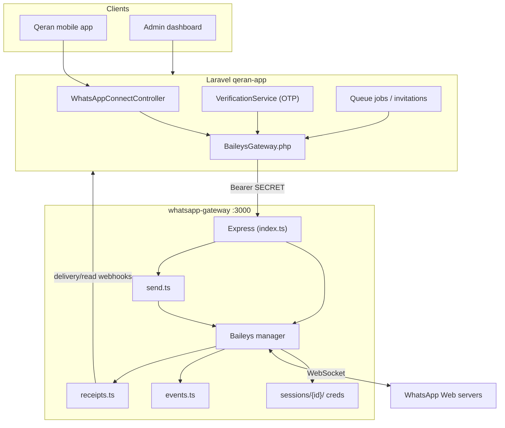
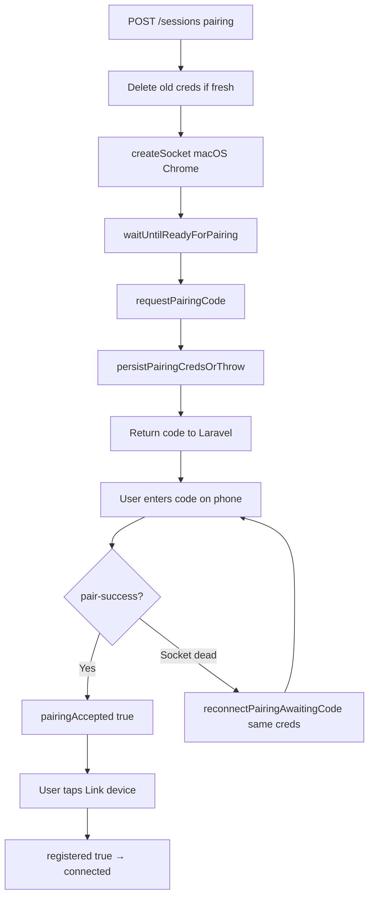

# Qeran WhatsApp Gateway — Complete Guide

> **Location:** `E:\Companies\Quantum-technology\qeran\qeran-app\whatsapp-gateway`  
> **Runtime:** Node.js 18+ · Express · [@whiskeysockets/baileys](https://github.com/WhiskeySockets/Baileys) 7.0.0-rc14  
> **Current version:** `1.4.7` (see `GET /health`)  
> **Last updated:** 2026-08-07

---

## Table of contents

1. [What is this service?](#1-what-is-this-service)
2. [Architecture](#2-architecture)
3. [Project structure](#3-project-structure)
4. [Session types](#4-session-types)
5. [Requirements](#5-requirements)
6. [Installation & first run](#6-installation--first-run)
7. [Environment variables](#7-environment-variables)
8. [Running in production (PM2)](#8-running-in-production-pm2)
9. [HTTP API reference](#9-http-api-reference)
10. [Pairing code flow (mobile clients)](#10-pairing-code-flow-mobile-clients)
11. [QR flow (system / admin)](#11-qr-flow-system--admin)
12. [Sending messages](#12-sending-messages)
13. [Session storage on disk](#13-session-storage-on-disk)
14. [Connection lifecycle & reconnect](#14-connection-lifecycle--reconnect)
15. [Receipt webhooks](#15-receipt-webhooks)
16. [Laravel integration](#16-laravel-integration)
17. [Scripts & tooling](#17-scripts--tooling)
18. [Monitoring & troubleshooting](#18-monitoring--troubleshooting)
19. [Security notes](#19-security-notes)
20. [Related documentation](#20-related-documentation)

---

## 1. What is this service?

The **whatsapp-gateway** is a standalone Node.js microservice that:

- Maintains **WhatsApp Web linked-device sessions** using the Baileys library
- Exposes a simple **HTTP REST API** secured with a shared secret
- Is called by the **Qeran Laravel app** — Laravel never talks to WhatsApp directly

### Use cases in Qeran

| Session | Who links | Method | Purpose |
|---------|-----------|--------|---------|
| `system` | Admin (dashboard) | **QR code** | OTP registration, password reset, contact-us, admin replies |
| `user_{id}` | Mobile app user | **Pairing code** | Client sends bulk wedding invitations from their own WhatsApp |

### What it does **not** do

- It is not the Laravel app itself
- It does not serve the Qeran website UI (except optional QR setup HTML page)
- It does not replace WhatsApp Business API (official Meta API)

---

## 2. Architecture



**Auth:** All API routes except `GET /health` require:

```http
Authorization: Bearer <BAILEYS_GATEWAY_SECRET>
```

The same secret must be set in Laravel `.env` as `BAILEYS_GATEWAY_SECRET`.

---

## 3. Project structure

```
whatsapp-gateway/
├── src/
│   ├── index.ts                 # Express app, routes, startup
│   └── baileys/
│       ├── manager.ts           # Sessions, sockets, pairing, reconnect, watchdog
│       ├── send.ts              # Outbound text messages
│       ├── events.ts            # Inbound message handlers
│       └── receipts.ts          # Delivery/read webhooks to Laravel
├── scripts/
│   ├── patch-baileys-405.mjs    # Postinstall: WEB → MACOS platform fix
│   ├── setup-whatsapp-session.sh # First-time system QR setup helper
│   └── test-api.sh              # API smoke tests
├── sessions/                    # Auth state per session (gitignored except .gitkeep)
├── docs/
│   ├── API.md                   # HTTP contract (Laravel-facing)
│   ├── GATEWAY_COMPLETE_GUIDE.md  # This file
│   └── PAIRING_CODE_PROBLEM_AND_SOLUTION.md
├── dist/                        # Compiled JS (npm run build)
├── ecosystem.config.cjs         # PM2 configuration
├── package.json
├── tsconfig.json
├── .env.example
└── README.md                    # Quick start
```

### Key source files

| File | Responsibility |
|------|----------------|
| `manager.ts` | Create/destroy Baileys sockets, pairing code, QR, reconnect after 515/405, persist creds, watchdog |
| `index.ts` | Map HTTP endpoints to manager functions |
| `send.ts` | `sendText(sessionId, to, message)` |
| `receipts.ts` | POST delivery/read status back to Laravel webhook |

---

## 4. Session types

### `system`

- **One per Qeran deployment**
- Linked via **QR** in admin dashboard or setup script
- Used for OTP and system messages
- **Must not use pairing code** — gateway wipes pairing creds if detected on system session

### `user_{laravelUserId}`

- **One per app user** (e.g. `user_203`)
- Linked via **pairing code** from mobile app
- Phone must match user's profile (E.164 digits, no `+`)
- Used when client sends invitations through their WhatsApp

### Session status values

| Status | Meaning |
|--------|---------|
| `starting` | Socket opening |
| `pending_qr` | Waiting for QR scan (system) |
| `pending_pairing` | Waiting for pairing code entry / Link device |
| `connected` | Live socket, can send messages |
| `disconnected` | No active session or logged out |
| `reconnecting` | Creds on disk, socket reconnecting |

---

## 5. Requirements

| Requirement | Version |
|-------------|---------|
| Node.js | ≥ 18 |
| npm | ≥ 9 |
| PM2 | Recommended for production |
| Outbound HTTPS/WSS | To `web.whatsapp.com` |
| Disk | Writable `SESSIONS_DIR` |

---

## 6. Installation & first run

### Local development

```bash
cd whatsapp-gateway
cp .env.example .env
# Edit .env — set BAILEYS_GATEWAY_SECRET

npm install          # also runs patch-baileys-405.mjs
npm run build
npm start            # or: npm run dev (tsx watch)
```

Verify:

```bash
curl http://127.0.0.1:3000/health
```

### Production deploy (typical path: `/www/wwwroot/whatsapp-gateway`)

```bash
cd /www/wwwroot/whatsapp-gateway
cp .env.example .env
# Edit .env

npm install
npm run build
pm2 start ecosystem.config.cjs
pm2 save
```

### After every code update

```bash
git pull
npm install
npm run build
pm2 restart whatsapp-gateway --update-env
curl -s http://127.0.0.1:3000/health | jq .version
```

---

## 7. Environment variables

Copy from `.env.example`. Critical variables:

| Variable | Required | Default | Description |
|----------|----------|---------|-------------|
| `PORT` | No | `3000` | HTTP listen port |
| `HOST` | No | `127.0.0.1` | Bind address (keep localhost if Laravel on same server) |
| `BAILEYS_GATEWAY_SECRET` | **Yes** | — | Shared secret with Laravel |
| `SESSIONS_DIR` | No | `./sessions` | Absolute path recommended in production |
| `LARAVEL_APP_URL` | For receipts | — | Used to POST delivery/read webhooks |
| `ENABLE_QR_SETUP_PAGE` | No | `true` | Browser QR page at `/sessions/:id/qr/page` |
| `LOG_LEVEL` | No | `info` | pino log level |

### Reconnect & pairing tuning

| Variable | Default | Purpose |
|----------|---------|---------|
| `RECONNECT_WIPE_THRESHOLD` | `0` | Auto-wipe creds after N reconnect failures (`0` = never) |
| `RECONNECT_BACKOFF_MS` | `5000,30000,120000` | Backoff between reconnects |
| `CONNECTED_SESSION_WATCHDOG_MS` | `30000` | Probe dead registered sessions |
| `CONNECTED_SESSION_HEARTBEAT_MS` | `45000` | Presence ping to prevent idle drop |
| `BAILEYS_KEEP_ALIVE_MS` | `25000` | WebSocket keep-alive |
| `PAIRING_LINK_DEVICE_WAIT_MS` | `25000` | Wait for "Link device" tap before force reconnect |
| `PAIRING_SOCKET_READY_TIMEOUT_MS` | `25000` | Max wait for socket before `requestPairingCode` |
| `PAIRING_READY_DELAY_MS` | `1500` | Delay before requesting code |
| `PAIRING_CODE_MAX_ATTEMPTS` | `3` | Retries if code request fails |
| `BAILEYS_VERSION` | auto | JSON array override e.g. `[2,3000,1044722137]` |

---

## 8. Running in production (PM2)

`ecosystem.config.cjs` defines the `whatsapp-gateway` process:

```bash
pm2 start ecosystem.config.cjs
pm2 status
pm2 logs whatsapp-gateway --lines 100
pm2 restart whatsapp-gateway
pm2 stop whatsapp-gateway
```

**Startup sequence** (automatic):

1. `ensureSessionsDir()`
2. `warmBaileysVersion()` — fetch live WA Web version
3. `restorePersistedSessions()` — reconnect registered sessions from disk
4. `startConnectedSessionWatchdog()` — periodic health probe

---

## 9. HTTP API reference

Base URL: `http://127.0.0.1:3000` (or `BAILEYS_GATEWAY_URL`)

Full contract: [API.md](./API.md)

### Endpoints summary

| Method | Path | Auth | Description |
|--------|------|------|-------------|
| `GET` | `/health` | No | Liveness, version, features, sessions dir |
| `GET` | `/health/receipt-probe` | Yes | Test receipt webhook to Laravel |
| `GET` | `/sessions/:id/qr/page?token=` | Token | HTML QR page for browser setup |
| `POST` | `/sessions` | Yes | Start QR or pairing session |
| `GET` | `/sessions/:id/status?quick=1` | Yes | Detailed status for polling |
| `GET` | `/sessions/:id/qr?waitMs=` | Yes | QR string + base64 PNG |
| `GET` | `/sessions/:id/pairing-code?phone=` | Yes | Get pairing code |
| `POST` | `/sessions/:id/finalize` | Yes | Complete pairing after code accepted |
| `POST` | `/send` | Yes | Send text message |
| `DELETE` | `/sessions/:id` | Yes | Logout + delete session files |

### `GET /health` response (example)

```json
{
  "ok": true,
  "version": "1.4.7",
  "cwd": "/www/wwwroot/whatsapp-gateway",
  "sessionsDir": "/www/wwwroot/whatsapp-gateway/sessions",
  "persistedSessions": ["system", "user_203"],
  "features": {
    "pairingCode": true,
    "qrPage": true,
    "deliveryReadReceipts": true
  }
}
```

### `POST /sessions` — pairing (mobile)

```json
{
  "sessionId": "user_203",
  "phone": "201090537394",
  "linkMethod": "pairing"
}
```

Response:

```json
{
  "sessionId": "user_203",
  "status": "pending_pairing",
  "pairingCode": "AQXG-1ZHE",
  "linkPhone": "201090537394",
  "linkMethod": "pairing",
  "authOnDisk": true
}
```

### `GET /sessions/:id/status?quick=1` — key fields

| Field | Meaning |
|-------|---------|
| `registeredOnDisk` | `creds.registered === true` |
| `pairingAccepted` | Phone accepted code (`creds.account` exists) |
| `pairingProgress` | `awaiting_code` \| `code_accepted` \| `registered` |
| `socketAlive` | WebSocket currently open |
| `waId` | WhatsApp JID e.g. `201090537394@s.whatsapp.net` |

### `POST /send`

```json
{
  "sessionId": "user_203",
  "to": "201012345678",
  "message": "Hello from Qeran",
  "referenceId": "optional-tracking-id"
}
```

---

## 10. Pairing code flow (mobile clients)

Handled by `startSessionWithPairing()` → `runPairingFlow()` in `manager.ts`.



**Baileys 405 fix:** On `npm install`, `scripts/patch-baileys-405.mjs` patches `Platform.WEB` → `Platform.MACOS`.

See [PAIRING_CODE_PROBLEM_AND_SOLUTION.md](./PAIRING_CODE_PROBLEM_AND_SOLUTION.md) for full troubleshooting history.

---

## 11. QR flow (system / admin)

```bash
# Start system session
curl -X POST http://127.0.0.1:3000/sessions \
  -H "Authorization: Bearer $SECRET" \
  -H "Content-Type: application/json" \
  -d '{"sessionId":"system","linkMethod":"qr"}'

# Get QR (waits up to 60s)
curl "http://127.0.0.1:3000/sessions/system/qr?waitMs=60000" \
  -H "Authorization: Bearer $SECRET"
```

Or use the setup script:

```bash
chmod +x scripts/setup-whatsapp-session.sh
./scripts/setup-whatsapp-session.sh
```

Browser page (if enabled):

```
/sessions/system/qr/page?token=YOUR_SECRET
```

---

## 12. Sending messages

```bash
curl -X POST http://127.0.0.1:3000/send \
  -H "Authorization: Bearer $SECRET" \
  -H "Content-Type: application/json" \
  -d '{
    "sessionId": "system",
    "to": "201090537394",
    "message": "Your OTP is 1234"
  }'
```

- `to`: digits only (country code + number)
- Session must be `connected`
- Returns `{ "sent": true, "idMessage": "..." }` or 503 with error

---

## 13. Session storage on disk

Default: `SESSIONS_DIR=./sessions`

```
sessions/
├── system/
│   ├── creds.json
│   └── app-state-sync-*.json
└── user_203/
    └── creds.json
```

| File | Content |
|------|---------|
| `creds.json` | Encryption keys, registration state, pairing code, `me.id` |
| Other JSON | Signal key store, app state |

**Important:**

- Never copy sessions between servers without understanding encryption
- Delete folder to force fresh link: `rm -rf sessions/user_203`
- Use `DELETE /sessions/:id` for clean logout

---

## 14. Connection lifecycle & reconnect

| Event | Gateway behavior |
|-------|------------------|
| `connection: open` | Status → `connected`, start heartbeat |
| `restartRequired` (515) | Reconnect with saved creds (normal after QR scan / pair-success) |
| `405` | Invalidate WA version cache, refetch, reconnect with MACOS patch |
| `loggedOut` (401) | Retry N times, then wipe creds |
| Socket dead + registered | Watchdog + status poll trigger reconnect |
| Pairing awaiting code + socket dead | `reconnectPairingAwaitingCode()` — same creds, no wipe |

---

## 15. Receipt webhooks

When `LARAVEL_APP_URL` is set, gateway POSTs message delivery/read events to Laravel:

```
POST {LARAVEL_APP_URL}/api/v1/webhooks/baileys-message-status
```

Probe:

```bash
curl http://127.0.0.1:3000/health/receipt-probe \
  -H "Authorization: Bearer $SECRET"
```

---

## 16. Laravel integration

### Laravel `.env`

```env
BAILEYS_GATEWAY_URL=http://127.0.0.1:3000
BAILEYS_GATEWAY_INTERNAL_URL=http://127.0.0.1:3000
BAILEYS_GATEWAY_SECRET=same-as-gateway-.env
BAILEYS_SYSTEM_SESSION=system
```

### Key Laravel files

| File | Role |
|------|------|
| `app/Services/External/BaileysGateway.php` | HTTP client |
| `app/Http/Controllers/Api/V1/WhatsApp/WhatsAppConnectController.php` | Mobile connect/status |
| `app/Services/Auth/VerificationService.php` | OTP via `system` session |
| `app/Models/WhatsappSession.php` | DB mirror of session state |

### Mobile API flow

1. `POST /api/v1/whatsapp/connect` → gateway pairing → returns code
2. `GET /api/v1/whatsapp/status` → poll until connected
3. `POST /api/v1/whatsapp/disconnect` → `DELETE /sessions/user_{id}`

---

## 17. Scripts & tooling

| Script | Usage |
|--------|--------|
| `npm run build` | Compile TypeScript → `dist/` |
| `npm start` | Run `dist/index.js` |
| `npm run dev` | Watch mode with tsx |
| `scripts/patch-baileys-405.mjs` | Auto-run on `npm install` |
| `scripts/setup-whatsapp-session.sh` | First-time system QR |
| `scripts/test-api.sh` | Smoke test all endpoints |

---

## 18. Monitoring & troubleshooting

### Quick checks

```bash
# Gateway alive + version
curl -s http://127.0.0.1:3000/health | jq .

# MACOS patch applied
grep PATCHED_MACOS_405 node_modules/@whiskeysockets/baileys/lib/Utils/validate-connection.js

# Live logs
pm2 logs whatsapp-gateway --lines 50

# Session status
curl -s "http://127.0.0.1:3000/sessions/user_203/status?quick=1" \
  -H "Authorization: Bearer $SECRET" | jq .
```

### Common issues

| Symptom | Check |
|---------|-------|
| 401 from gateway | `BAILEYS_GATEWAY_SECRET` mismatch |
| Laravel timeout | Gateway down, wrong URL, use internal URL |
| 405 in PM2 | Run `npm install`, verify patch, check WA version in logs |
| QR never appears | Wait 30s, check PM2, delete session and retry |
| Pairing "couldn't connect" | See [PAIRING_CODE_PROBLEM_AND_SOLUTION.md](./PAIRING_CODE_PROBLEM_AND_SOLUTION.md) |
| Bad MAC errors | Stale/corrupt session — delete and re-link |

---

## 19. Security notes

- Bind to `127.0.0.1` unless behind a reverse proxy with auth
- Use a long random `BAILEYS_GATEWAY_SECRET`
- Do not expose `/sessions/:id/qr/page` publicly without token
- Session folders contain cryptographic secrets — restrict filesystem permissions
- `RECONNECT_WIPE_THRESHOLD=0` prevents accidental credential wipe on transient failures

---

## 20. Related documentation

| Document | Description |
|----------|-------------|
| [PAIRING_CODE_PROBLEM_AND_SOLUTION.md](./PAIRING_CODE_PROBLEM_AND_SOLUTION.md) | Full A–Z pairing bug history and fixes |
| [API.md](./API.md) | HTTP API contract for Laravel |
| [../README.md](../README.md) | Quick deploy |
| [../../WHATSAPP_GATEWAY_REPORT.md](../../WHATSAPP_GATEWAY_REPORT.md) | Laravel-side technical report (admin, OTP, ops) |
| [../../whatsapp_workflow.md](../../whatsapp_workflow.md) | End-to-end workflow |
