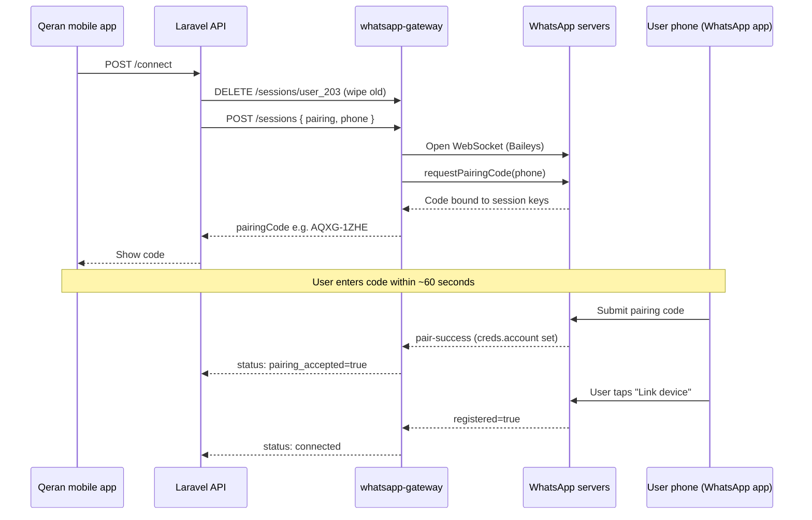

# WhatsApp Pairing Code — Problem & Solution (A to Z)

> **Audience:** Developers and ops working on Qeran client WhatsApp linking (`user_{id}` sessions).  
> **Gateway version when documented:** `1.4.7`  
> **Last updated:** 2026-08-07

---

## Table of contents

1. [What we were trying to do](#1-what-we-were-trying-to-do)
2. [Expected pairing flow (happy path)](#2-expected-pairing-flow-happy-path)
3. [Symptoms users saw](#3-symptoms-users-saw)
4. [Root causes (in order of discovery)](#4-root-causes-in-order-of-discovery)
5. [How each problem was diagnosed](#5-how-each-problem-was-diagnosed)
6. [Solutions implemented](#6-solutions-implemented)
7. [Files changed](#7-files-changed)
8. [Deploy checklist after fixes](#8-deploy-checklist-after-fixes)
9. [How to verify a successful link](#9-how-to-verify-a-successful-link)
10. [Common mistakes (user & app)](#10-common-mistakes-user--app)
11. [If pairing still fails](#11-if-pairing-still-fails)

---

## 1. What we were trying to do

Qeran mobile app users link **their own WhatsApp number** so invitation messages are sent from the client's phone (not the Qeran system number).

| Item | Value |
|------|--------|
| Session ID | `user_{laravelUserId}` (e.g. `user_203`) |
| Link method | **Pairing code** (not QR) |
| Phone format | E.164 digits only, no `+` (e.g. Egypt `201090537394`) |
| Stack | Mobile app → Laravel API → **whatsapp-gateway** (Baileys) → WhatsApp servers |

The user opens WhatsApp → **Linked devices** → **Link with phone number**, enters the 8-character code shown in the Qeran app, then taps **Link device** if WhatsApp shows a security warning.

---

## 2. Expected pairing flow (happy path)



### creds.json states during flow

| Stage | `registered` | `account` | `pairingCode` | `me.id` | Meaning |
|-------|--------------|-----------|---------------|---------|---------|
| After code issued | `false` | absent | set | set | Code generated; waiting for user input |
| After code accepted on phone | `false` | **present** | set | set | User entered code; may need "Link device" tap |
| Fully linked | `true` | present | may remain | set | Session ready to send messages |

> **Important:** `me.id` is set as soon as `requestPairingCode()` runs — it does **NOT** mean the user entered the code. Only `creds.account` (or gateway `pairingAccepted: true`) means the phone accepted the code.

---

## 3. Symptoms users saw

| Symptom | When |
|---------|------|
| Pairing code takes **50–60+ seconds** | `/connect` slow |
| WhatsApp shows **"Couldn't link device"** / **"Couldn't connect"** | After entering code on phone |
| Laravel log: `finalizing link after pairing code accepted` then new code issued | Connect called again during pairing |
| Laravel: `gateway start failed — Connection Closed` | Socket died before code issued |
| Gateway PM2: `statusCode: 405` | WhatsApp rejected the client |
| `pairing_accepted: true` but never `connected` | Finalize/reconnect issues |
| Code shown in app but link fails silently | Socket dead when user enters code |

### Example failing log (405)

```json
{"sessionId":"user_203","status":"pending_pairing","msg":"WhatsApp connecting"}
{"sessionId":"user_203","statusCode":405,"status":"pending_pairing","msg":"connection closed"}
{"sessionId":"user_203","code":"AQXG-1ZHE","msg":"pairing socket closed while awaiting code — reconnecting with saved creds"}
```

Example `creds.json` when link fails (code issued but pair-success never arrived):

```json
{
  "registered": false,
  "pairingCode": "AQXG1ZHE",
  "me": { "id": "201090537394@s.whatsapp.net", "name": "~" }
}
```

No `account` field → WhatsApp never completed pairing on the gateway side.

---

## 4. Root causes (in order of discovery)

### 4.1 False `pairingAccepted` detection

**Problem:** Gateway treated `creds.me.id` as "code accepted". Baileys sets `me.id` when `requestPairingCode()` runs, **before** the user types anything.

**Effect:** Laravel called finalize/reconnect too early, invalidating the in-progress link.

**Fix:** `pairingAccepted` is true only when `creds.account` exists or WhatsApp fires `pair-success` (`pairingConfirmedByPhone`).

---

### 4.2 Repeat `/connect` during active pairing

**Problem:** Mobile app called `POST /connect` again while status was `pending_pairing`. Laravel wiped the session and issued a **new** code mid-link.

**Effect:** Old code invalidated; user entered a code WhatsApp no longer recognized.

**Fix:** `resumeActivePairingConnect()` in `WhatsAppConnectController` — if pairing is in progress, return existing code instead of deleting session (unless `force=true`).

---

### 4.3 QR events misclassified during phone pairing

**Problem:** QR events during pairing set status to `pending_qr`, triggering QR reconnect/watchdog logic.

**Effect:** Wrong reconnect path; session wiped or refreshed incorrectly.

**Fix:** `isPhonePairingFlow()` — ignore QR events when `linkPhone` or `pending_pairing`.

---

### 4.4 Socket reopen loop invalidated pairing code

**Problem:** `maintainPairingSocketAlive` recreated sockets with new keys after close.

**Effect:** WhatsApp binds the code to specific session keys; new socket = "couldn't link device".

**Fix (refined):** Do not wipe keys. Reconnect with **same** `creds.json` via `reconnectPairingAwaitingCode()`. Wiping vs reconnecting with saved creds was initially confused.

---

### 4.5 Slow pairing code generation (50–60s)

**Problem:** Multiple stacked delays:

- `fetchLatestBaileysVersion()` on every socket create (network call)
- Full timeout wait on connection close (no fail-fast)
- 4 retries with long backoff + 3s pre-request delay
- Laravel `deleteSession` always waited up to 35s

**Fix:** Cache/warm WA version at startup; shorter timeouts; 3 attempts; 10s delete when already disconnected; target **8–20s** for code issuance.

---

### 4.6 Socket dead when user enters code (no reconnect)

**Problem:** After code issued, WhatsApp often closes the WebSocket. Code blocked reconnection thinking it would invalidate the code.

**Effect:** User enters code; no live socket to receive `pair-success` → phone shows "couldn't connect".

**Fix:** `reconnectPairingAwaitingCode()` — reopen socket using existing auth files; code is bound to **creds**, not the TCP connection.

---

### 4.7 HTTP 405 — `client_too_old` (main blocker after timing fixes)

**Problem:** WhatsApp rejects connections with:

- **Stale WA Web version** (e.g. `[2,3000,1033893291]` cached at gateway boot)
- **Platform.WEB** in Baileys 6.7.x (WhatsApp now expects **Platform.MACOS** for new pairings per [Baileys #2364](https://github.com/WhiskeySockets/Baileys/issues/2364))

**Effect:** Socket connects briefly, then `statusCode: 405`, connection closed. Pairing code may be issued but socket cannot stay alive for handshake.

**Fix (gateway v1.4.7):**

1. Upgrade to **Baileys 7.0.0-rc14**
2. Use **`fetchLatestWaWebVersion()`** (live version, not stale cache)
3. **Postinstall patch** `scripts/patch-baileys-405.mjs` — `Platform.WEB` → `Platform.MACOS` in `validate-connection.js`
4. Invalidate version cache on 405 and refetch before reconnect
5. Always use `Browsers.macOS('Chrome')` (not `Desktop` / DARWIN sub-platform)

---

### 4.8 `reconnectAfterRestart` broke pairing state

**Problem:** Reconnect cleared `meta.pairingCode`, set status to `starting` (switched browser to Desktop), and waited for `connected` before registration completed.

**Fix:** Preserve `pending_pairing` + pairing code during awaiting-code reconnect; skip `waitForConnected` until after pair-success.

---

## 5. How each problem was diagnosed

| Clue | Points to |
|------|-----------|
| Laravel `finalizing link` + immediate new `fresh pairing code` | Repeat connect wiping session |
| `pairing_accepted: true` but `registered: false` in creds | Finalize too early or stuck at "Link device" |
| `me.id` set, no `account` in creds.json | Code not yet accepted on phone (or socket dead) |
| Gateway `attempt: 2` creating fresh socket | First `requestPairingCode` failed; retry |
| PM2 `statusCode: 405` | Stale version or WEB platform — **not** a phone number typo |
| PM2 `statusCode: 515` + `restartRequired` | Normal after pair-success — must reconnect |
| `Connection Closed` on connect | Socket died during code generation |
| Code issued in ~8s but link fails | 405 or dead socket after issue |

---

## 6. Solutions implemented

### Gateway (`whatsapp-gateway`) — v1.4.0 → v1.4.7

| Area | Change |
|------|--------|
| Pairing detection | `getPairingProgress()` — `pairingAccepted` only with `creds.account` |
| Socket lifecycle | `reconnectPairingAwaitingCode()`, keepalive reconnect with saved creds |
| 405 fix | Baileys 7.0.0-rc14 + MACOS patch + `fetchLatestWaWebVersion()` |
| Performance | Version cache/warm, fail-fast on close, shorter retries/delays |
| Browser | Always `Browsers.macOS('Chrome')` |
| QR vs pairing | `isPhonePairingFlow()` guards |
| Persistence | `persistPairingCredsOrThrow()` before returning code |
| Paths | Absolute `SESSIONS_DIR`, health shows `sessionsDir` + `persistedSessions` |

### Laravel (`qeran-app`)

| Area | Change |
|------|--------|
| Connect | `resumeActivePairingConnect()` — no wipe during active pairing |
| Status API | `ui_phase`, `show_pairing_code`, `pairing_progress`, `action` fields |
| Finalize | `refreshStatusAfterPairingAccepted()` — finalize even when socket alive |
| Timeouts | Shorter `deleteSession` (10s) when disconnected; 75s pairing start |
| Errors | `BaileysGateway::mapErrorMessage()` friendly messages |
| i18n | `lang/en/messages.php`, `lang/ar/messages.php` pairing strings |

---

## 7. Files changed

### Gateway

| File | Role |
|------|------|
| `src/baileys/manager.ts` | Core pairing, reconnect, 405 handling, version resolve |
| `src/index.ts` | HTTP API, health version, status payloads |
| `scripts/patch-baileys-405.mjs` | Postinstall MACOS platform patch |
| `package.json` | Baileys 7.0.0-rc14, postinstall script |

### Laravel

| File | Role |
|------|------|
| `app/Http/Controllers/Api/V1/WhatsApp/WhatsAppConnectController.php` | Connect, status, resume pairing |
| `app/Services/External/BaileysGateway.php` | HTTP client, timeouts, error mapping |
| `lang/en/messages.php`, `lang/ar/messages.php` | User-facing messages |

---

## 8. Deploy checklist after fixes

Run on the server (`/www/wwwroot/whatsapp-gateway` or your path):

```bash
cd /www/wwwroot/whatsapp-gateway
git pull

npm install          # installs Baileys 7 + runs patch-baileys-405.mjs
npm run build
pm2 restart whatsapp-gateway

# Verify
curl -s http://127.0.0.1:3000/health
# Expect: "version": "1.4.7"

grep PATCHED_MACOS_405 node_modules/@whiskeysockets/baileys/lib/Utils/validate-connection.js
# Expect: Platform.MACOS, // PATCHED_MACOS_405

# Clean stale session before test
curl -X DELETE -H "Authorization: Bearer YOUR_SECRET" \
  http://127.0.0.1:3000/sessions/user_203
rm -rf sessions/user_203
```

Deploy Laravel changes and run:

```bash
php artisan config:clear
php artisan cache:clear
```

---

## 9. How to verify a successful link

### Laravel logs (good)

```
WhatsApp connect: pairing code issued {"pairing_code":"XXXX-XXXX"}
WhatsApp status: pending_pairing {"pairing_progress":"awaiting_code","action":"enter_code_in_whatsapp"}
WhatsApp status: pending_pairing {"pairing_accepted":true,"pairing_progress":"code_accepted","action":"tap_link_device_in_whatsapp"}
WhatsApp status: connected (or registered_on_disk: true)
```

### Gateway PM2 logs (good)

```
"source":"fetchLatestWaWebVersion"
"version":[2,3000,1044722137]    ← live version, NOT 1033893291
pairing code ready
creds.update: pair-success from phone
restartRequired — reconnecting
WhatsApp connected
```

### creds.json (fully linked)

```json
"registered": true,
"account": { ... },
"me": { "id": "201090537394@s.whatsapp.net" }
```

---

## 10. Common mistakes (user & app)

| Mistake | Result |
|---------|--------|
| Tap **Connect** again while pairing | Session wiped, new code, old code invalid |
| Poll `/connect` instead of `/status` | Same as above |
| Enter code after 60+ seconds | Code expired |
| Wrong phone number in app vs WhatsApp account | Link fails |
| Many pairing attempts in short time | WhatsApp rate limit |
| Gateway not restarted after deploy | Old 6.7.18 still running, 405 continues |
| `npm install` skipped | MACOS patch not applied |

### Mobile app rules

1. Call **`POST /connect` once** to start pairing.
2. Poll **`GET /status`** only until `connected`.
3. When `pairing_accepted: true`, hide code; show "Tap Link device in WhatsApp".
4. Do **not** call connect again unless user explicitly retries with `force=true`.

---

## 11. If pairing still fails

### Checklist

1. **Health version** — must be `1.4.7+`
2. **MACOS patch** — grep `PATCHED_MACOS_405` in `validate-connection.js`
3. **WA version in logs** — must be `1044xxxxxx`+, not `1033893291`
4. **No 405 in PM2** after code issued
5. **Session wiped** before clean test
6. **Same server** — Laravel uses `BAILEYS_GATEWAY_INTERNAL_URL=http://127.0.0.1:3000`

### Optional env overrides (gateway `.env`)

```env
# Force specific WA version if fetch fails
BAILEYS_VERSION=[2,3000,1044722137]

PAIRING_SOCKET_READY_TIMEOUT_MS=25000
PAIRING_READY_DELAY_MS=1500
PAIRING_CODE_MAX_ATTEMPTS=3
```

### Datacenter IP note

WhatsApp may reject some cloud/datacenter IPs for pairing while QR works from residential IP. If 405 persists after all fixes, test from a different network or contact hosting provider.

### Related docs

- [GATEWAY_COMPLETE_GUIDE.md](./GATEWAY_COMPLETE_GUIDE.md) — full gateway reference
- [API.md](./API.md) — HTTP API contract
- [../README.md](../README.md) — quick deploy
